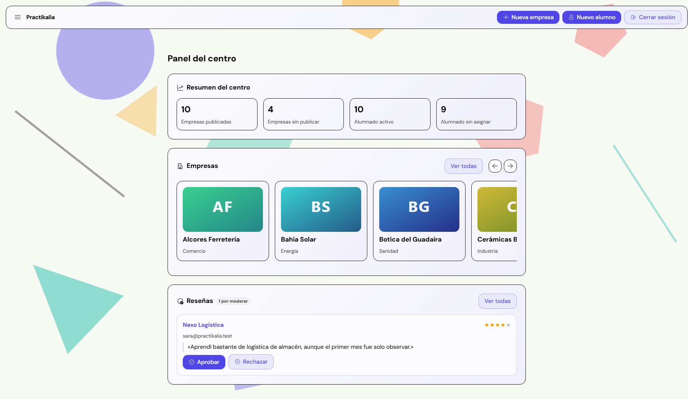
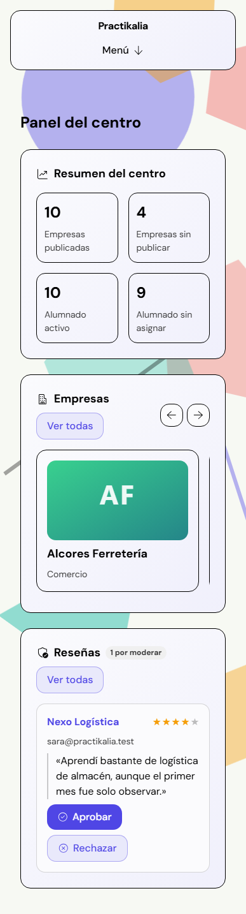

# Practikalia

Plataforma open source y autohosteable para que centros educativos gestionen sus empresas de prácticas: histórico, reviews moderadas y afinidad alumno-empresa.

No es una bolsa de empleo ni un clon de LinkedIn — es una red cerrada por centro. El alumnado consulta empresas, reviews y su afinidad estimada; el profesorado modera contenido, gestiona el histórico y ve los datos sensibles. El objetivo es convertir en herramienta reutilizable el conocimiento sobre empresas de prácticas que hoy se pierde en hojas de cálculo sueltas.

Visión funcional completa, roles y roadmap: [docs/briefing.md](docs/briefing.md).

## Estado actual

Primera beta (`0.1.0-beta`), pensada para usarse desde la vista de administrador o de
profesor con permisos de administrador. La vista de un profesor sin esos permisos, la
de alumnado y el flujo completo de alta/primer acceso de una cuenta nueva ya existen,
pero todavía no se han verificado en uso real.

Ya funciona (con margen de mejora):

- Alta y autenticación de usuarios: login con JWT en cookie, cambio de contraseña obligatorio, auto-registro de alumnado por correo institucional (nace pendiente de aprobación), alta y edición de alumnado y de profesorado desde la interfaz.
- Directorio de empresas: listado paginado, detalle y alta/edición, con buscador por nombre/sector/etiquetas, filtros avanzados, imagen y filtro por estado de publicación desde el panel.
- Sectores y etiquetas: catálogo en árbol de tres niveles (sector → actividad → etiqueta) editable por un administrador sin tocar la base de datos.
- Asignación de prácticas: empresa, profesor de empresa y tutor de empresa por alumno, con histórico y grado/año.
- Reviews de profesorado (publicación directa) y de alumnado (con moderación docente), moderación por estado (pendientes/aprobadas/rechazadas) con reversión de una decisión ya tomada.
- Intereses del alumnado por empresa y afinidad básica.
- Configuración del centro: nombre, logo y whitelist de correos permitidos, desde la interfaz.
- Panel diferenciado por rol (alumno/profesor), con navegación propia y contadores del centro (empresas, alumnado).

Lo marcado como "a futuro" o "más adelante" en el [briefing](docs/briefing.md#roadmap) (OTP, 2FA, métricas de contratación, motor de afinidad avanzado, federación entre instancias...) sigue siendo **WIP**. Imágenes de backend y frontend publicadas en [Docker Hub](https://hub.docker.com/u/sdurutr436) y CI/CD con GitHub Actions (tests, Trivy, publicación de imágenes) — ver la [documentación técnica](https://sdurutr436.github.io/practikalia/).

## Stack


- **Frontend**: Angular 22, TypeScript, SCSS (ITCSS + BEM), pnpm.
- **Backend**: Java 25, Spring Boot 4.1, Spring Security, Spring Data JPA, Flyway, JWT (jjwt), springdoc-openapi.
- **Base de datos**: PostgreSQL 17.
- **Infraestructura**: Docker / Docker Compose, Nginx como proxy inverso.

## Capturas de pantalla

Pantalla de acceso y panel general, en desktop y en móvil. Son las únicas capturas disponibles por ahora — se irán añadiendo más a medida que el resto de pantallas se estabilice (**WIP**).

<table>
<tr>
<td align="center">
<br>
<sub>Acceso — Desktop</sub>
</td>
<td align="center">
<br>
<sub>Acceso — Móvil</sub>
</td>
</tr>
<tr>
<td align="center">
<br>
<sub>Panel general — Desktop</sub>
</td>
<td align="center">
<br>
<sub>Panel general — Móvil</sub>
</td>
</tr>
</table>

## Estructura

```text
practikalia/
├── backend/          # API Spring Boot
├── frontend/          # Aplicación Angular (imagen final: Nginx + estáticos)
├── docs/              # Documentación funcional y técnica
└── docker-compose.yml
```

## Desarrollo local

### Backend

```bash
cd backend
./mvnw spring-boot:run
```

### Frontend

```bash
cd frontend
pnpm install
pnpm start
```

## Despliegue en tu propio servidor (circuito cerrado)

Practikalia está pensado para instalarse en un servidor dentro de la red del propio centro, no en internet público. Cualquier PC de esa red debe poder usar la app sin tocar CORS ni conocer la URL real del backend.

Con las imágenes ya publicadas, sin clonar el repositorio ni compilar nada:

```bash
curl -O https://raw.githubusercontent.com/sdurutr436/practikalia/main/docker-compose.prod.yml
curl -O https://raw.githubusercontent.com/sdurutr436/practikalia/main/.env.example
mv .env.example .env   # ajusta DB_PASSWORD y JWT_SECRET (openssl rand -base64 32)
docker compose -f docker-compose.prod.yml up -d
```

O construyendo desde el código (`docker-compose.yml` en vez de `docker-compose.prod.yml`):

```bash
git clone <url-del-repo>
cd practikalia
cp .env.example .env   # ajusta DB_PASSWORD y JWT_SECRET
docker compose up --build -d
```

`DB_PASSWORD` y `JWT_SECRET` no tienen valor por defecto — falta cualquiera de los dos y `docker compose up` falla con un mensaje claro, en vez de arrancar con un secreto conocido.

Ambas vías levantan tres servicios (`postgres`, `backend`, `frontend`), pero el único que necesita ser alcanzable desde otros equipos es `frontend`, que escucha en el puerto 80 del servidor y actúa como único punto de entrada: es una imagen de Nginx con los estáticos ya compilados dentro (ver [frontend/Dockerfile](frontend/Dockerfile)).

- Sirve el frontend compilado en `/`.
- Reenvía todo lo que llega a `/api/` hacia el backend interno (ver [frontend/nginx.conf](frontend/nginx.conf)).

Así el navegador de cualquier PC solo habla con `frontend`; nunca ve el host ni el puerto reales del backend. Esa es la ruta enmascarada que pide el briefing: da igual desde qué equipo del centro se acceda, todas las peticiones van al mismo origen y no hace falta configurar cada cliente para que sepa dónde está la API.

### Para que cualquier PC del centro lo alcance

- El servidor necesita una IP fija (o reservada por DHCP) dentro de la red del centro, con el puerto 80 abierto en su firewall.
- Cada PC accede simplemente con `http://<ip-del-servidor>/`.
- Si se prefiere un nombre en vez de una IP (`http://practikalia.local/` o el que decida el centro), hay que resolverlo fuera de la app: entrada en el DNS/router del centro o en el archivo hosts de cada equipo. Practikalia no incluye ni automatiza esa parte — **queda pendiente (WIP)**, depende de la infraestructura de cada centro.
- Solo si construyes desde el código: `docker-compose.yml` también publica el puerto 8080 del backend para depurar en directo (`docker-compose.prod.yml` no lo hace). En un despliegue real conviene cerrarlo en el firewall, ya que todo el tráfico de la app pasa por `frontend` en el puerto 80.

## Licencia

[MIT](LICENSE). El proyecto está pensado para ser open source y desplegable por cualquier centro en su propia infraestructura.

Ver también [CODE_OF_CONDUCT.md](CODE_OF_CONDUCT.md), [SECURITY.md](SECURITY.md) y [CHANGELOG.md](CHANGELOG.md).
