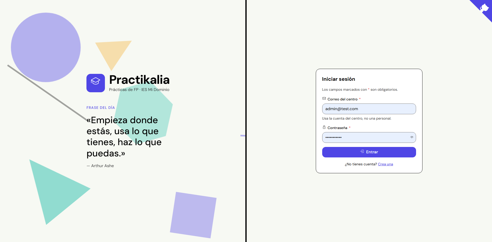
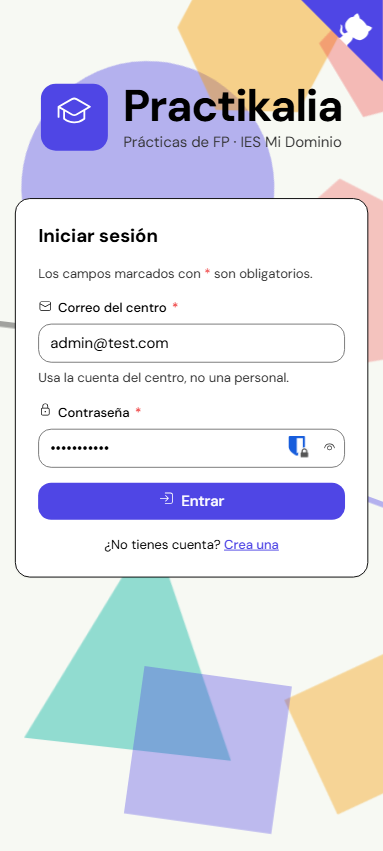

# Practikalia

Plataforma open source y autohosteable para que centros educativos gestionen sus empresas de prácticas: histórico, reviews moderadas y afinidad alumno-empresa.

No es una bolsa de empleo ni un clon de LinkedIn — es una red cerrada por centro. El alumnado consulta empresas, reviews y su afinidad estimada; el profesorado modera contenido, gestiona el histórico y ve los datos sensibles. El objetivo es convertir en herramienta reutilizable el conocimiento sobre empresas de prácticas que hoy se pierde en hojas de cálculo sueltas.

Visión funcional completa, roles y roadmap: [docs/briefing.md](docs/briefing.md).

## Estado actual

Proyecto en desarrollo activo, pre-MVP. Ya funciona (con margen de mejora):

- Alta y autenticación de usuarios: login con JWT en cookie, cambio de contraseña obligatorio, auto-registro de alumnado por correo institucional.
- Directorio de empresas: listado, detalle y alta/edición.
- Reviews de profesorado (publicación directa) y de alumnado (con moderación docente).
- Intereses del alumnado por empresa y afinidad básica.
- Panel diferenciado por rol (alumno/profesor) con navegación propia.

Lo marcado como "a futuro" o "más adelante" en el [briefing](docs/briefing.md#roadmap) (OTP, 2FA, métricas de contratación, motor de afinidad avanzado, federación entre instancias...) sigue siendo **WIP**.

## Stack


- **Frontend**: Angular 22, TypeScript, SCSS (ITCSS + BEM), pnpm.
- **Backend**: Java 25, Spring Boot 4.1, Spring Security, Spring Data JPA, Flyway, JWT (jjwt), springdoc-openapi.
- **Base de datos**: PostgreSQL 17.
- **Infraestructura**: Docker / Docker Compose, Nginx como proxy inverso.

## Capturas de pantalla

Pantalla de acceso, en desktop y en móvil. Son las únicas capturas disponibles por ahora — se irán añadiendo más a medida que el resto de pantallas se estabilice (**WIP**).

<table>
<tr>
<td align="center">
<br>
<sub>Desktop</sub>
</td>
<td align="center">
<br>
<sub>Móvil</sub>
</td>
</tr>
</table>

## Estructura

```text
practikalia/
├── backend/          # API Spring Boot
├── frontend/          # Aplicación Angular
├── docs/              # Documentación funcional y técnica
├── nginx/             # Configuración de nginx para despliegue
└── docker-compose.yml
```

## Desarrollo local

### Backend

```bash
cd backend
./mvnw spring-boot:run
```

### Frontend

```bash
cd frontend
pnpm install
pnpm start
```

## Despliegue en tu propio servidor (circuito cerrado)

Practikalia está pensado para instalarse en un servidor dentro de la red del propio centro, no en internet público. Cualquier PC de esa red debe poder usar la app sin tocar CORS ni conocer la URL real del backend.

```bash
git clone <url-del-repo>
cd practikalia
cp .env.example .env   # ajusta DB_NAME, DB_USER, DB_PASSWORD
docker compose up --build -d
```

Esto levanta cuatro servicios (`postgres`, `backend`, `frontend`, `nginx`), pero el único que necesita ser alcanzable desde otros equipos es `nginx`, que escucha en el puerto 80 del servidor y actúa como único punto de entrada:

- Sirve el frontend compilado en `/`.
- Reenvía todo lo que llega a `/api/` hacia el backend interno (ver [nginx/nginx.conf](nginx/nginx.conf)).

Así el navegador de cualquier PC solo habla con `nginx`; nunca ve el host ni el puerto reales del backend. Esa es la ruta enmascarada que pide el briefing: da igual desde qué equipo del centro se acceda, todas las peticiones van al mismo origen y no hace falta configurar cada cliente para que sepa dónde está la API.

### Para que cualquier PC del centro lo alcance

- El servidor necesita una IP fija (o reservada por DHCP) dentro de la red del centro, con el puerto 80 abierto en su firewall.
- Cada PC accede simplemente con `http://<ip-del-servidor>/`.
- Si se prefiere un nombre en vez de una IP (`http://practikalia.local/` o el que decida el centro), hay que resolverlo fuera de la app: entrada en el DNS/router del centro o en el archivo hosts de cada equipo. Practikalia no incluye ni automatiza esa parte — **queda pendiente (WIP)**, depende de la infraestructura de cada centro.
- `docker-compose.yml` también publica el puerto 8080 del backend para depurar en directo. En un despliegue real conviene cerrarlo en el firewall (o quitar ese mapeo), ya que todo el tráfico de la app pasa por `nginx` en el puerto 80.

## Licencia

[MIT](LICENSE). El proyecto está pensado para ser open source y desplegable por cualquier centro en su propia infraestructura.

Ver también [CODE_OF_CONDUCT.md](CODE_OF_CONDUCT.md), [SECURITY.md](SECURITY.md) y [CHANGELOG.md](CHANGELOG.md).
